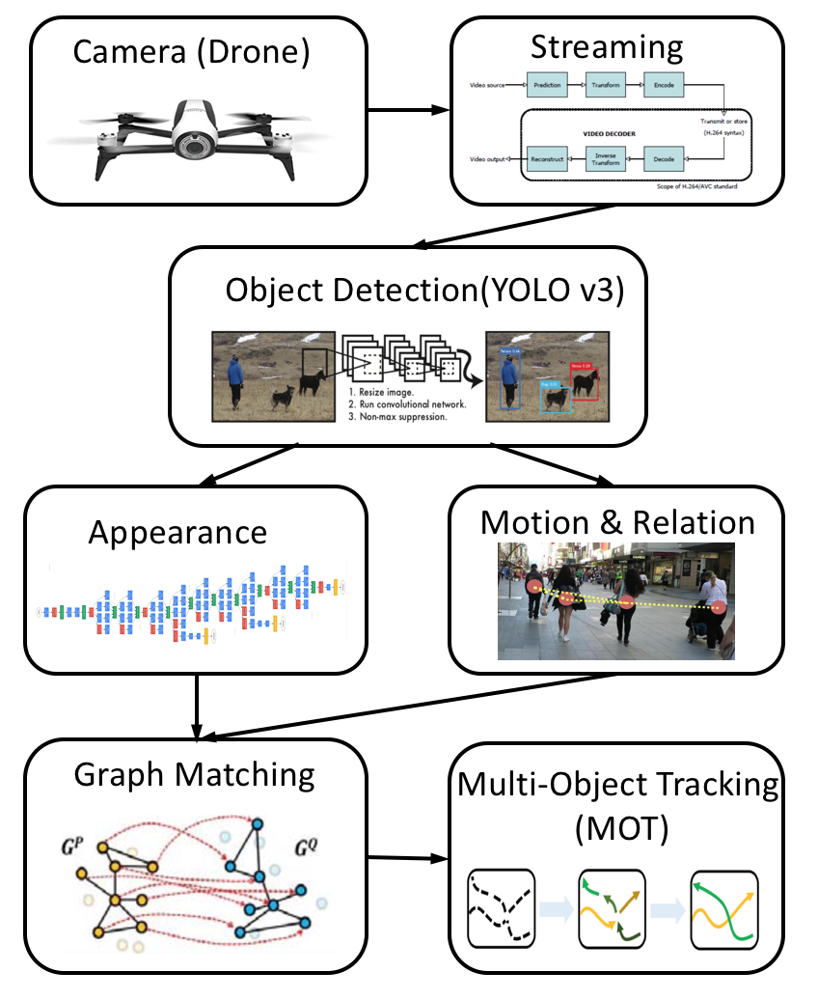

# YOLO_TRACKING #

## Overview

This is the repo for multi-object tracking based on [YOLOv3](https://pjreddie.com/darknet/yolo/). we focus on achieving a real-time tracking system which integrates state-of-art object detection algorithm and multi object tracking algorithm into single one system. This can take us one step further to realizing a fully automatic and highly intelligent security system. We also apply the system on UAV to achieve the real-time multi object tracking on UAV video streaming.

## Team
[Hao(Alex) Xiao](https://github.com/AlexXiao95), [Haotian Zhang](https://github.com/Haotian-Zhang), [Sujie Zhu](https://github.com/SujieZhu)

## Framework
The system can be roughly divided into two mainly part, which are object detection part and multi object tracking part. First, we will use the WIFI to stream the video from the drone to the computer. Then we apply object detection frame by frame. For every object in one frame, we extract the appearance feature and motion feature and send these information into multi object tracking part.

 

## Usage

* Install [darknet](https://pjreddie.com/darknet/install/)

* Download the pre-trained weight file:
``
wget https://pjreddie.com/media/files/yolov3.weights
``

* Run real-time tracking on webcam:
``
./darknet detector demo cfg/coco.data cfg/yolov3.cfg yolov3.weights -c CAM_ID 
``

* Run real-time tracking on video file:
``
./darknet detector demo cfg/coco.data cfg/yolov3.cfg yolov3.weights <video_file>
``

* Run real-time tracking on drone video (Should [set up video stream](http://developer.parrot.com/blog/2016/play-bebop-stream-on-vlc/) first):
``
./darknet detector demo cfg/coco.data cfg/yolov3.cfg yolov3.weights bebop.sdp
``

## Reference

For more information about darknet and YOLO, please refer to [Darknet project website](http://pjreddie.com/darknet).

For questions or issues please use the [Google Group](https://groups.google.com/forum/#!forum/darknet).
